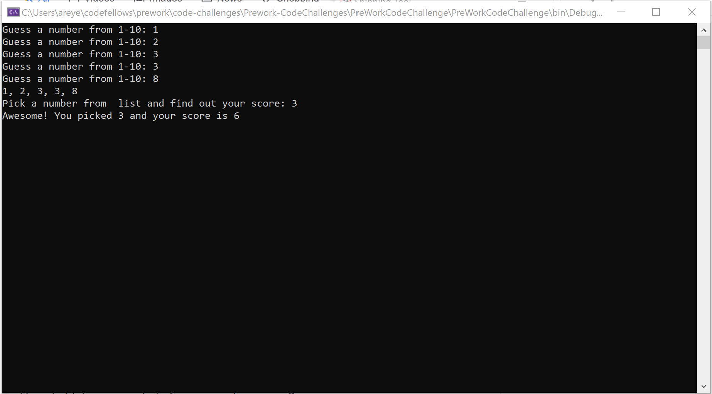

# Prework-CodeChallenges

## Array Max Result

Instructions: User is prompted to enter a number from 1 - 10. After doing so they are shown the array of their inputted numbers and will have to choose a single number from that array. Once chosen, the user will receive their score for the game.

**Result** 

 