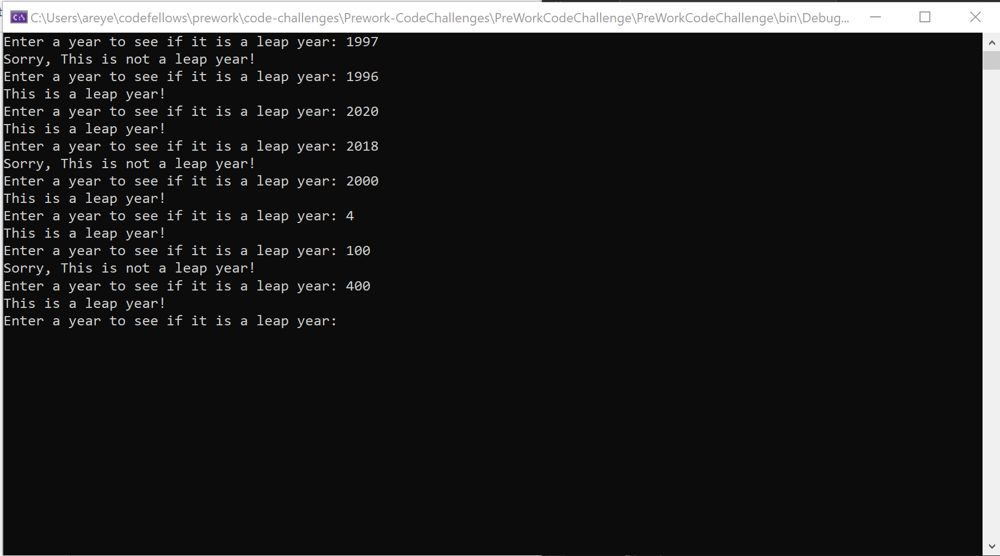
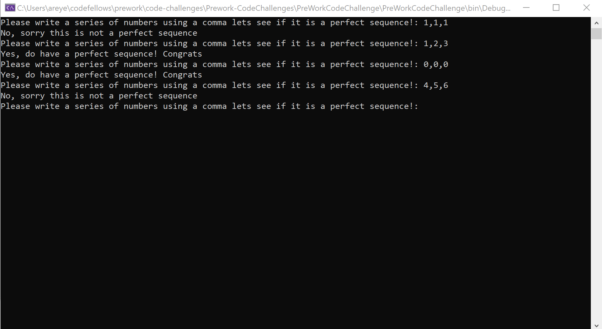
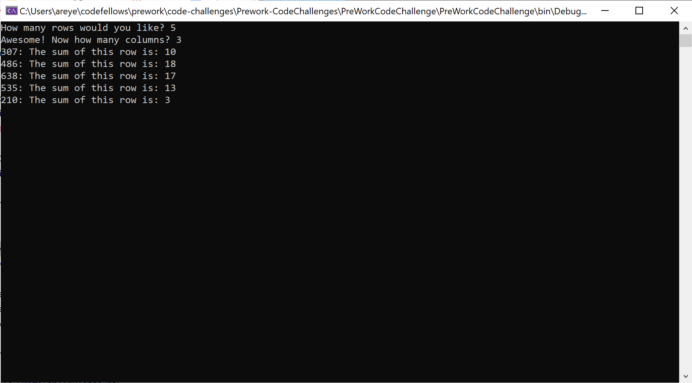

# Prework-CodeChallenges

## Array Max Result

**Instructions:** User is prompted to enter a number from 1 - 10. After doing so they are shown the array of their inputted numbers and will have to choose a single number from that array. Once chosen, the user will receive their score for the game.

### Result

 

## Leap Year Calculator 

**Instructions:** User is prompted in the console to enter a year and the console calulates and outputs whether or not that year is a leap year or not. 

### Result

## Perfect Sequence

**Instructions:** User is instructed to enter a series of numbers using a comma. Then the console notifies user if their numbers are a perfect sequence or not.

### Result

## Sum of Rows

**Instructions:** User is asked how many rows and columns they want and that is inputted into the length of their arrays. The console generates random numbers and adds all the numbers within the row.

### Result

